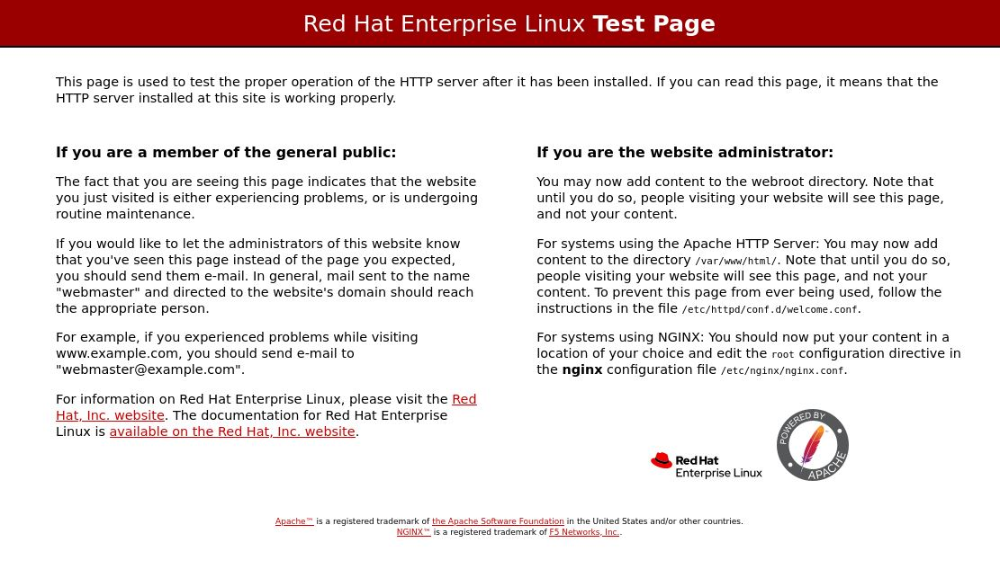

**Apache WebServer (HTTPD) Setup**
=====================================

Install httpd
--------
.. code-block:: console

    sudo yum install httpd
.. image:: images/httpd-install.JPG
    
SELinux is installed by default and runs in Enforcing mode. To allow Apache to connect to databases through SELinux, run the following command

.. code-block:: console
   
   sudo setsebool -P httpd_can_network_connect_db 1
   
Restart Apache and test the sample script

.. code-block:: console
   
   sudo apachectl restart
 
Enable httpd Service at boot time
--------
 
.. code-block:: console
   
   sudo systemctl enable httpd.service

   
Default RHEL Sample Site
--------
Visit http://localhost or http://127.0.0.1 to view default httpd server sample site

HTTPD Service Actions
--------
Common HTTPD Commands for regular operations

.. code-block:: console
   
   sudo systemctl start httpd.service     ## Start Apache ##
   sudo systemctl stop httpd.service      ## Stop Apache ##
   sudo systemctl restart httpd.service   ## Restart Apache ##
   sudo systemctl reload httpd.service    ## Reload Apache ##
   sudo systemctl status httpd.service    ## Get status of Apache ##

Allow Port 80/443
--------

Common Ports for HTTP services are

- 80 for NON SSL
- 443 for SSL

Unblock Port 80 using firewall-cmd

.. code-block:: console
   
   sudo firewall-cmd --permanent --add-service=http --zone=public
   sudo firewall-cmd --reload
   sudo firewall-cmd --list-services --zone=public
   
Unblock Port 443 using firewall-cmd

.. code-block:: console
   
   sudo firewall-cmd --permanent --add-service=https --zone=public
   sudo firewall-cmd --reload
   sudo firewall-cmd --list-services --zone=public

