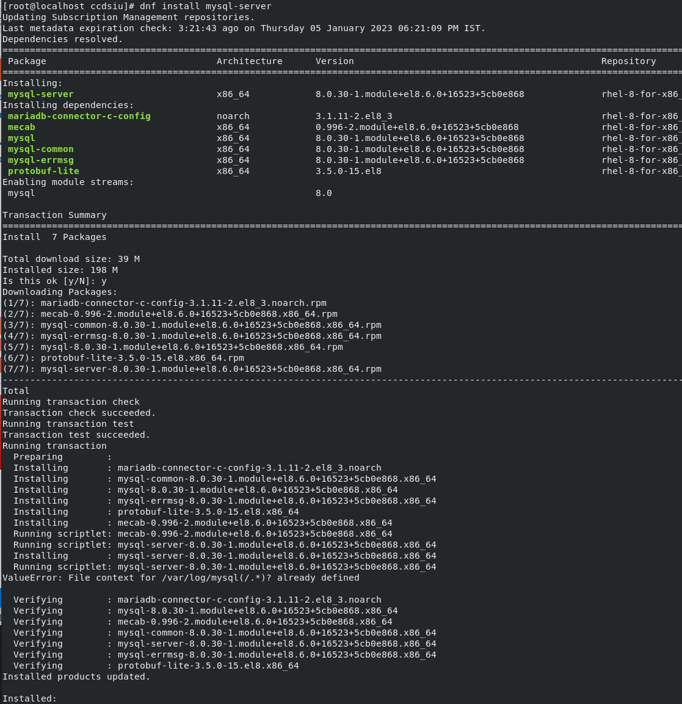
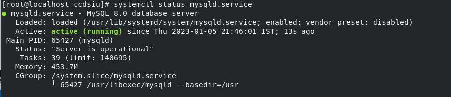
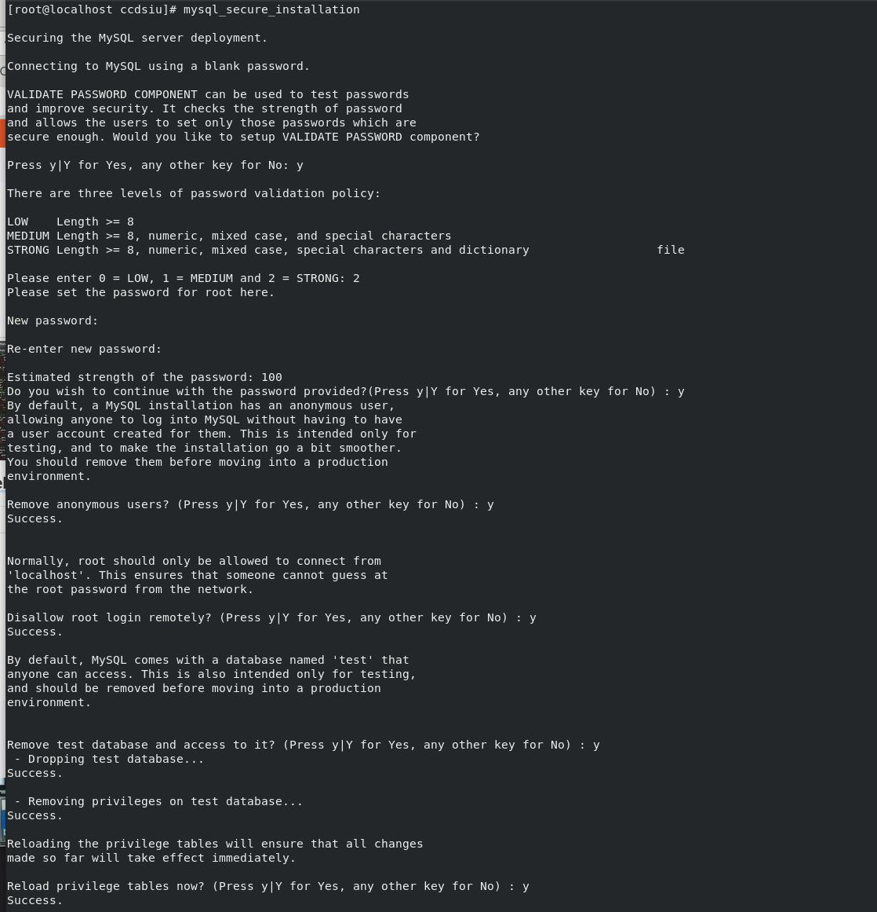
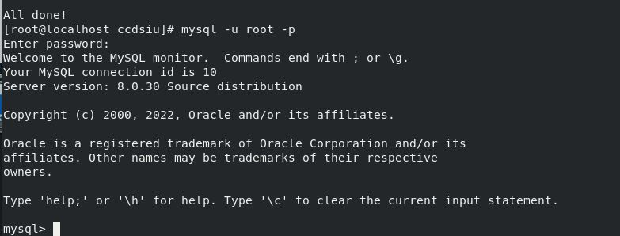
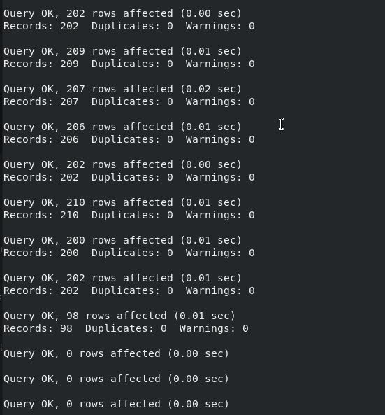

Installing MYSQL Server & Importing SQL
==========================================

**Install MySQL 8 **
--------
.. code-block:: console

    dnf install mysql-server

    
**Start MySQL**  
-------------
.. code-block:: console

  systemctl start mysqld

**Enable MySQL at Boot**  
-------------
.. code-block:: console

  systemctl enable --now mysqld
  
**View MySQL Status**  
-------------
.. code-block:: console

  systemctl status mysqld

**Securing MySQL**  
-------------
.. code-block:: console

  mysql_secure_installation
  
- Type your password and press Y to set up the VALIDATE PASSWORD component which checks whether the new password is strong enough.
- Next, enter 0, 1, or 2 depending on the password strength you want to set :
    - 0 - Low. The password consists of at least 8 characters.
    - 1 - Medium. The password consists of at least 8 characters (including numeric, mixed case, and special characters).
    - 2 - Strong. The password consists of at least 8 characters (including numeric, mixed case, and special characters, and compares the password to a dictionary file).
- Once you specify the required strength, enter and re-enter the password.
- The program evaluates the strength of your password and requires confirmation with Y to continue.
- Next you need to answer the following security features:
    - Remove anonymous users?
    - Disallow root login remotely?
    - Remove test database and access to it?
    - Reload privilege tables now?

**Login to MySQL**  
-------------
Once MySQL installation is secured, you can log in to the MySQL shell, and start creating new databases and users.
.. code-block:: console

  mysql -u root -p

**Creating Database**  
-------------
Once MySQL user is logged in,we can create database (**gamo** is the database name)
.. code-block:: console

  create database gamo;
  
Select the database using this command

.. code-block:: console

  use gamo;
  
**Importing Database**  
-------------
Import the sql file of the gamo database using this command (Replace the path with your sql location)

.. code-block:: console

  source /home/***/**.sql;
  

