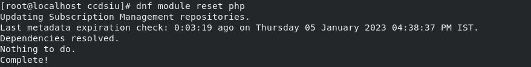
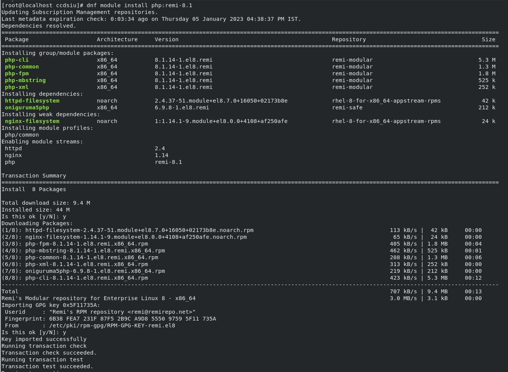
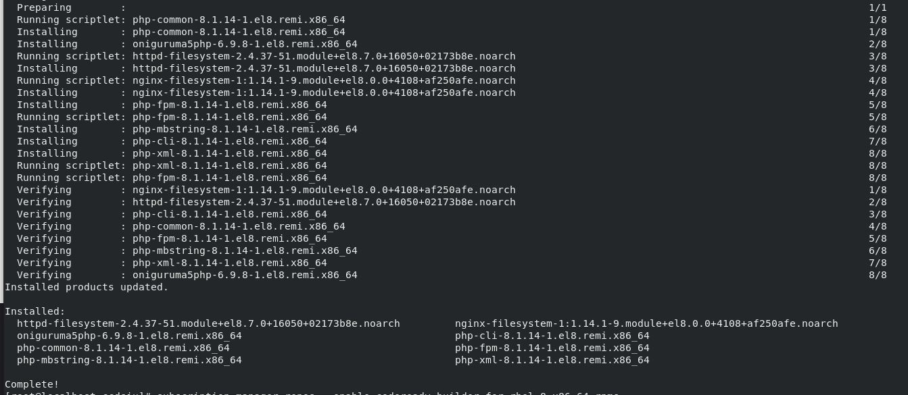
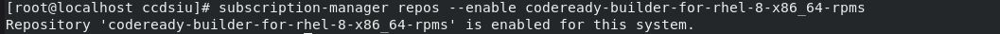
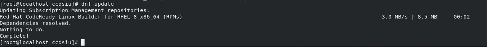
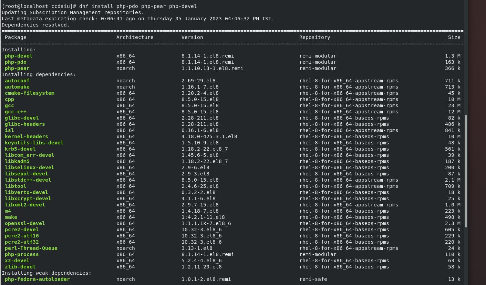
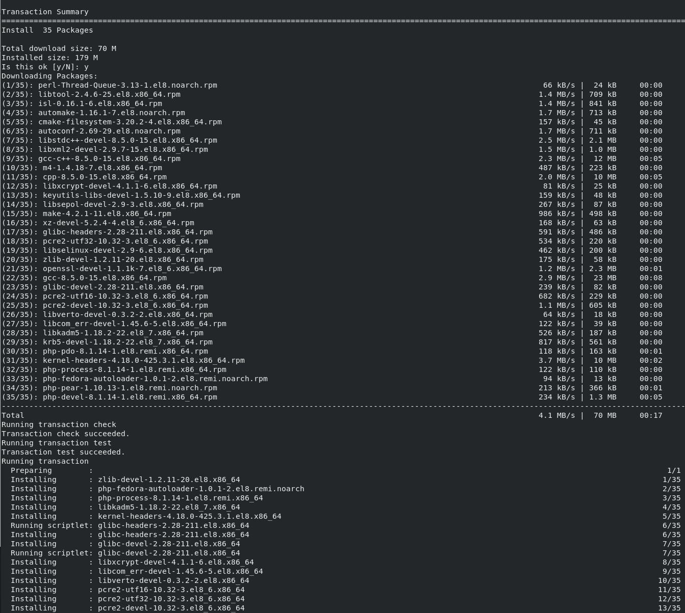
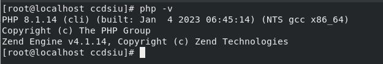

Installing PHP-8.1
=====================================

**Reset PHP**
--------
.. code-block:: console

    dnf module reset php

    
**Install PHP-8.1**  
-------------
.. code-block:: console

  dnf module install php:remi-8.1

**Enable CodeReady Builder REPO**
-------------
.. code-block:: console

  subscription-manager repos --enable codeready-builder-for-rhel-8-x86_64-rpms

 
**DNF Update**
---------------------
.. code-block:: console

  dnf update

**Dev Extensions**
---------------------
.. code-block:: console

  dnf install php-pdo php-pear php-devel

**Check Version**
---------------------
.. code-block:: console

  php -v

