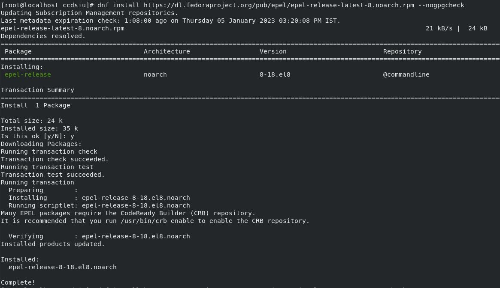
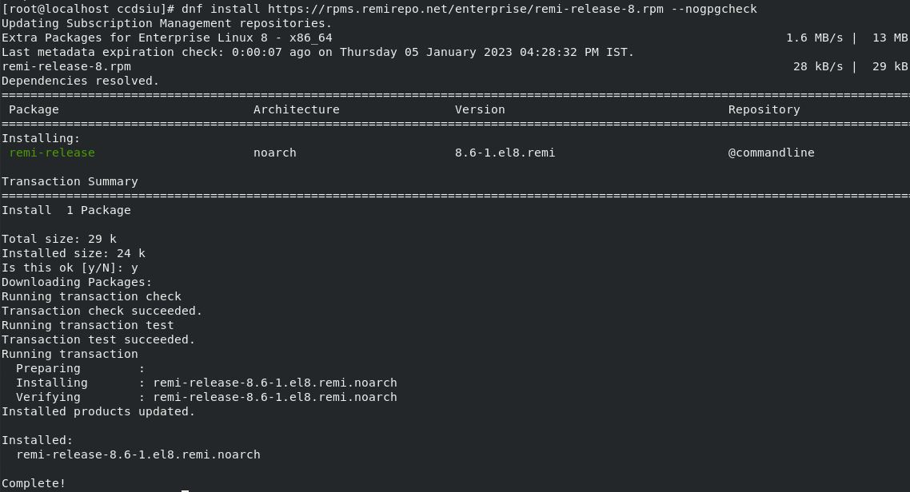
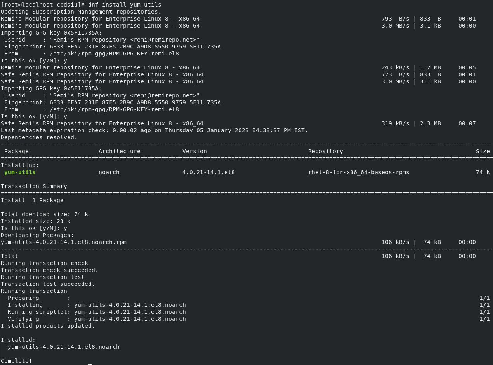

**Prerequisites**
==================================================

Login to Sudo
--------
.. code-block:: console

    sudo su
    
Add EPEL 
-------------
.. code-block:: console

  dnf install https://dl.fedoraproject.org/pub/epel/epel-release-latest-8.noarch.rpm

Add REMI
-------------
.. code-block:: console

  dnf install https://rpms.remirepo.net/enterprise/remi-release-8.rpm 

 
Add YUM UTILS
---------------------
.. code-block:: console

  dnf install yum-utils

