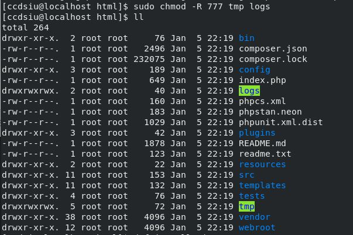
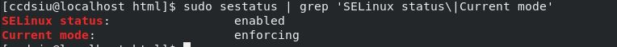
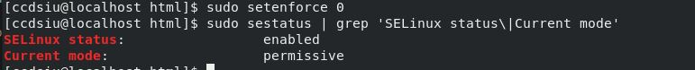
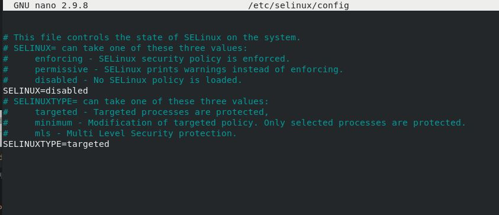
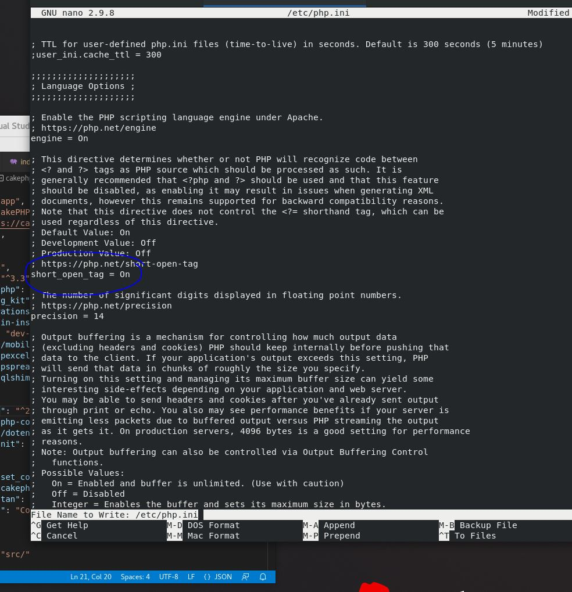
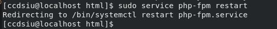
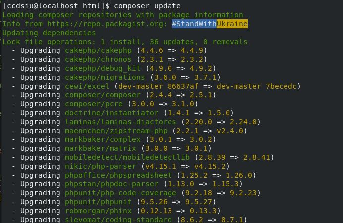
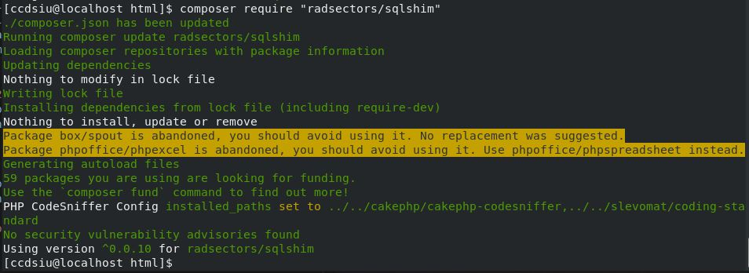

GAMO Platform Configuration
==========================================

- Extract the source code zip or clone the repo into the the root of the virtualhost which we created

**CHOWN app root with user**
--------------------------------------
**ccdsiu** is the username of staging server,Replace it with your username

.. code-block:: console

   sudo chown -R ccdsiu:ccdsiu /var/www/html

**CHMOD folders**
--------------------------------------
Give **777** Permissions to following folders

 - logs
 - tmp

.. code-block:: console

   sudo chmod -R /var/www/html/tmp
   
.. code-block:: console

   sudo chmod -R /var/www/html/logs

**SeLINUX Status**
-----------
Check selinux status ,it should be **disabled** or atleast set to **permissive**

To Check the current status of selinux

.. code-block:: console

    sudo sestatus | grep 'SELinux status\|Current mode'
    

If Status is **enforcing**,We need to either disable the selinux or set it permissive based on your server

To temporarily disable the selinux 

.. code-block:: console

    sudo setenforce 0

To permanently disable the selinux ,set the status to **SELINUX=disabled**

.. code-block:: console

    sudo /nano /etc/selinux/config

Then reboot the server to change the selinux status

**PHP.INI short_open_tag**
-----------
Set short_open_tag status to **On**

.. code-block:: console

    sudo nano /etc/php.ini
    

Restart the PHP FPM to change 

.. code-block:: console

    sudo service php-fpm restart

**Composer update**
-----------
Try to update the composer (Updates may vary from time to time)

.. code-block:: console

    composer update

**radsectors/sqlshim** package may need to be updated 

.. code-block:: console

    composer require "radsectors/sqlshim"

**DB & Other Params**
-----------    
- Mysql Credentials can be set in [config/app.php] : **Datasources->default** object

.. code-block:: console

    'default' => [
                 <!--Other lines-->
                'host' => 'localhost',
                'username' => 'root',
                'password' => 'xxxxxxx',
                'database' => 'gamo',
                <!--Other lines-->
    ],

- SQL Server Credentials can be set in [config/app.php] : **Datasources->reporting** object

.. code-block:: console

    'reporting' => [
             <!--Other lines-->
            'host' => 'localhost\SQLEXPRESS',
            'port' => '51433',
            'username' => "MADHU-PC\Madhu",
            'password' => "1234",
            'database' => 'Gamo',
            <!--Other lines-->
        ]

- Radius Server Credentials can be set in [config/app.php] : **RadiusServerData** object

.. code-block:: console

    'RadiusServerData'=>[
        'host' => '127.0.0.1',
        'password' => 'testing123',
        'port'=> 1812
    ],
    
**Working Mode**
-----------    
Path       : **[config/app.php]**

Class name : **debug**

- **true**  for Development
- **false** for Production

.. code-block:: console

    'debug' => filter_var(env('DEBUG', true), FILTER_VALIDATE_BOOLEAN),
    
