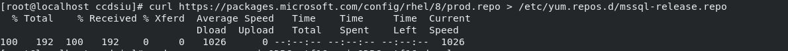
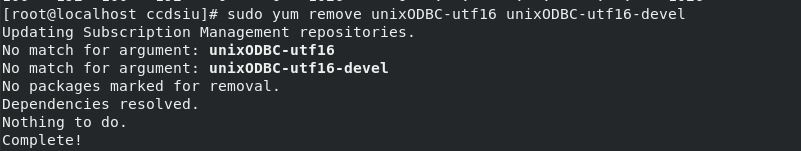
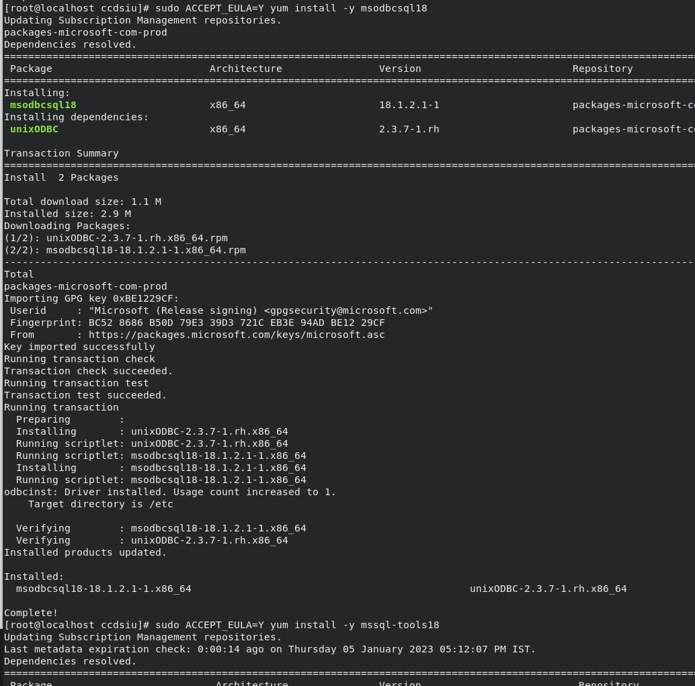
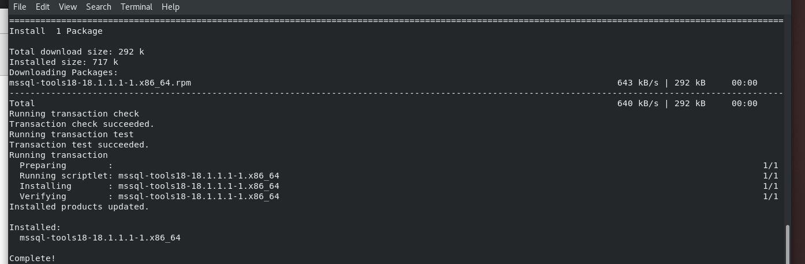
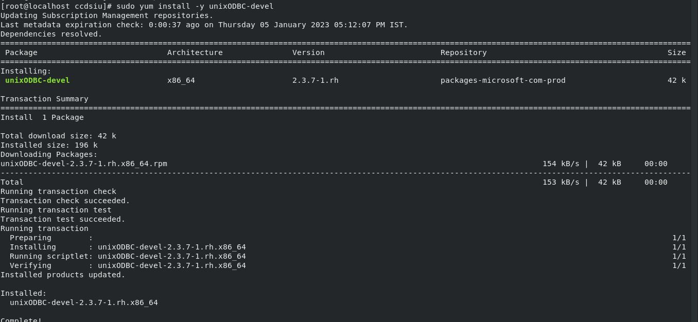
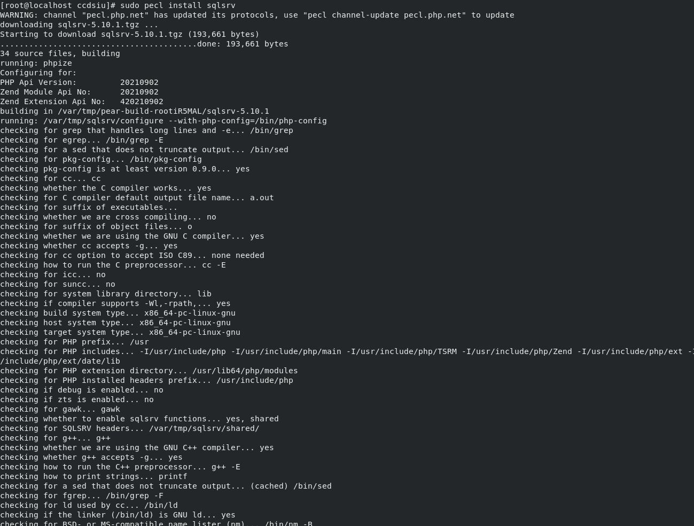
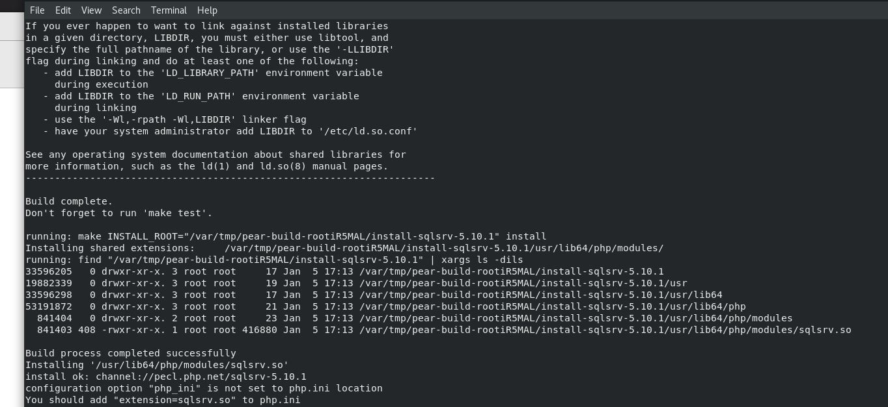
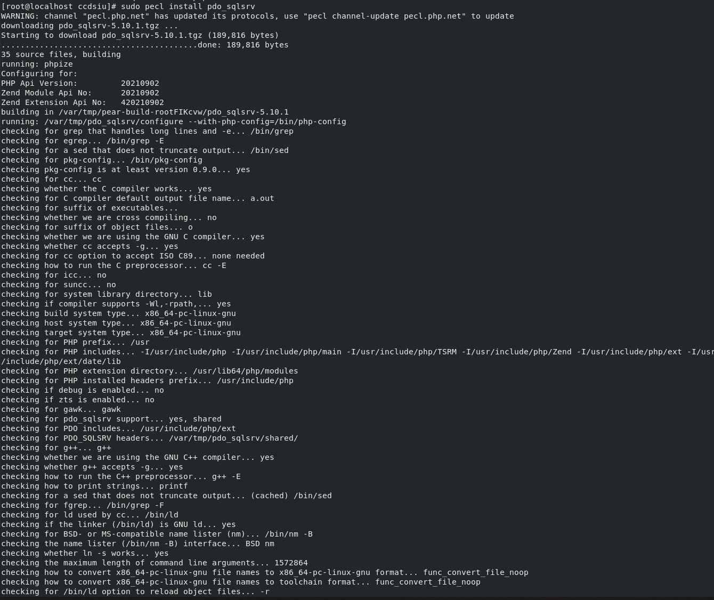
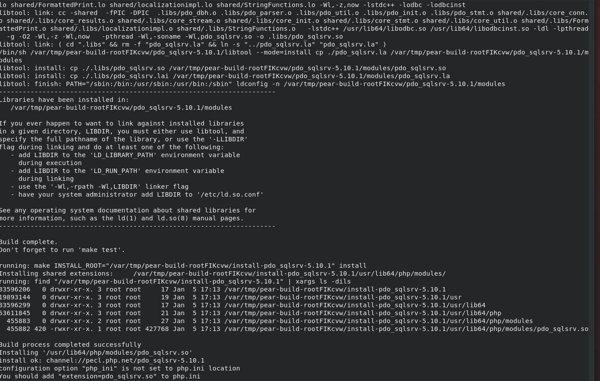
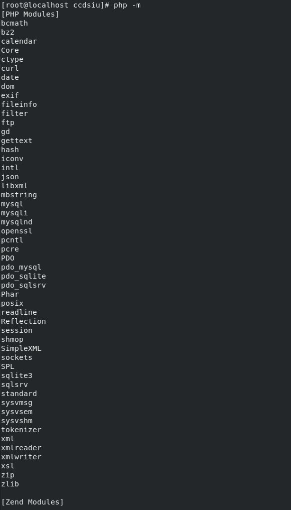

**PHP-SQLSRV**
=====================================

Prerequisites to Install SQLSRV
-------------------
Add MSSQL REPO

.. code-block:: console

    curl https://packages.microsoft.com/config/rhel/8/prod.repo > /etc/yum.repos.d/mssql-release.repo
    

Remove Other UNIX ODBCS to avoid conflicts

.. code-block:: console

    sudo yum remove unixODBC-utf16 unixODBC-utf16-devel
    

Install MSODBC18 and MSODBC18 Tools

.. code-block:: console

    sudo ACCEPT_EULA=Y yum install -y msodbcsql18
    
.. code-block:: console
    sudo ACCEPT_EULA=Y yum install -y mssql-tools18
    

Install UNIXODBC-DEVEL
--------
.. code-block:: console

    sudo yum install -y unixODBC-devel

    

Module SQLSRV
--------
.. code-block:: console

    sudo pecl install sqlsrv

    
Module PDO-SQLSRV
--------

.. code-block:: console

    sudo pecl install pdo_sqlsrv
    

Export SQLSRV & PDO-SQLSRV Modules
--------

.. code-block:: console

    echo extension=pdo_sqlsrv.so >> `php --ini | grep "Scan for additional .ini files" | sed -e "s|.*:\s*||"`/30-pdo_sqlsrv.ini
    echo extension=sqlsrv.so >> `php --ini | grep "Scan for additional .ini files" | sed -e "s|.*:\s*||"`/20-sqlsrv.ini
    

Exit to check PHP version and modules

.. code-block:: console

  exit

Check Installed Modules
---------------------
Check the modules installed,it should have sqlsrv and all other extensions listed as below

.. code-block:: console

  php -m

