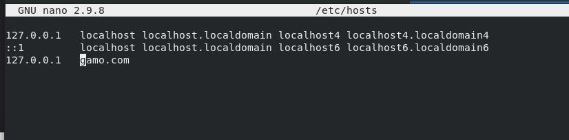

Setting New Virtual Host
==========================================
- Let us assume we want to use the domain **gamo.com** as our url
- Point A record of server ip to this domain **gamo.com using dns or map it in OS hosts if platform is local

**Add Domain to Local OS Hosts**
.. code-block:: console

  sudo nano /etc/hosts
  

c
    
The default template for virtual host in **httpd** is as follows

We installed the code in the following directory **/var/www/html/webroot**

.. code-block:: bash

  <VirtualHost *:80>
      ServerName gamo.com
      ServerAlias www.gamo.com
      ServerAdmin arja.kiran@impressico.com
      DocumentRoot /var/www/html/webroot
  
      <Directory /var/www/html>
          Options -Indexes +FollowSymLinks
          AllowOverride All
      </Directory>
  
      ErrorLog /var/log/httpd/gamo.com-error.log
      CustomLog /var/log/httpd/gamo.com-access.log combined
  </VirtualHost>

Restart HTTPD Server after adding new virtualhost
-----------
Web server needs to restart to view the changes

.. code-block:: console

    sudo systemctl restart httpd

    
